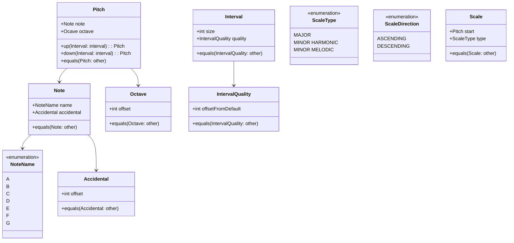

# Paper Music

## Music theory library

A library of classes for use in musical applications

### Model

```mermaid
classDiagram
    class NoteName {
        <<enumeration>>
        A
        B
        C
        D
        E
        F
        G
    }
    class Accidental {
        +int offset
        +equals(Accidental: other)
    }
    class Note {
        +NoteName name
        +Accidental accidental
        +equals(Note: other)
    }
    class Octave {
        +int offset
        +equals(Octave: other)
    }
    class Pitch {
        +Note note
        +Ocave octave
        +up(Interval: interval): Pitch
        +down(Interval: interval): Pitch
        +equals(Pitch: other)
    }
    class IntervalQuality {
        +int offsetFromDefault
        +equals(IntervalQuality: other)
    }
    class Interval {
        +int size
        +IntervalQuality quality
        +equals(IntervalQuality: other)
    }
    class ScaleType {
        <<enumeration>>
        MAJOR
        MINOR HARMONIC
        MINOR MELODIC
    }
    class ScaleDirection {
        <<enumeration>>
        ASCENDING
        DESCENDING
    }
    class Scale {
        +Pitch start
        +ScaleType type
        +equals(Scale: other)
    }
    Note --> NoteName
    Note --> Accidental
    Pitch --> Note
    Pitch --> Octave
    Interval --> IntervalQuality
```